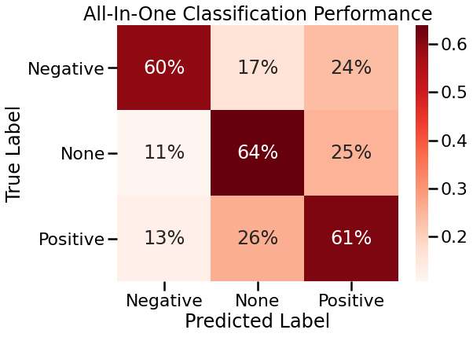
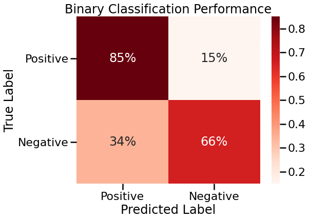
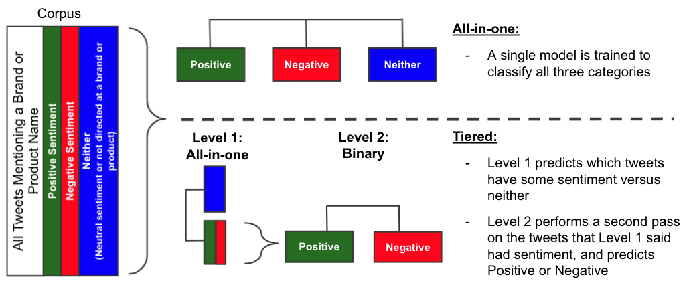

# Using Machine Learning to Detect Sentiment in Tweets - A Proof of Concept

This project is a proof-of-concept designed to answer the following questions:
- Can simple machine learning models such as Naive Bayes or Logistic Regression can be trained to detect product sentiment in tweets with reasonable accuracy? Or do we need to use more complex models such as deep learning?
- Can these simple models can provide useful, actionable insights?


# Business Problem

Knowing what customers like best about your products and brand is important if you want to both retain existing customers as well as attract new ones. Likewise, knowing what customers do not like about your brand or products will illuminate areas where change may be needed, especially if your competitors do well in those areas.

Customers may provide feedback directly to you in the form of responses to surveys you conduct, and voluntary product reviews. However, it can be difficult to design surveys that completely avoid response bias, and voluntary product reviews tend to [skew towards more polarized opinions](https://hbr.org/2018/03/online-reviews-are-biased-heres-how-to-fix-them). 

Analyzing what the general public says about your brand and products on platforms such as Twitter may yield insights other methods miss. But since it would be cost- and time-prohibitive to have human beings analyze and classify large volumes of tweets, a more automated method would be needed.

This analysis is a proof-of-concept to determine if a machine learning model can be trained to predict positive or negative sentiment. There are two primary objectives that an analysis leveraging machine learning would need to meet:

1. Starting with a corpus of tweets, separate out those in which a positive or negative sentiment towards a brand or product is expressed from those in which the sentiment is either neutral, or the sentiment is not actually directed towards your brand or product.
2. Provide useful or actionable insights into the keywords, topics, or concepts that drive negative versus positive sentiment.

# Dataset Overview

I used a dataset consisting of about 9,000 tweets that were posted during a SXSW event, and most of which are related to either Apple or Google brands or products. 

The tweets were coded by humans, who were asked to classify them based on emotion related to brands and products. Here is the brief overview from [data.world](https://data.world/crowdflower/brands-and-product-emotions) describing what the coders were asked to do:

>Contributors evaluated tweets about multiple brands and products. The crowd was asked if the tweet expressed positive, negative, or no emotion towards a brand and/or product. If some emotion was expressed they were also asked to say which brand or product was the target of that emotion. 

I did not attempt to differentiate between Google and Apple brands and products, but rather focused on a model that could identify tweets which had some sentiment towards either brand.

By far the majority of tweets were labeled as having no sentiment towards a brand or product. Of those which were identified as including a sentiment, most were coded positive. Only about 500 out of 9,000 were identified as negative.


Below are the most common n-grams in the entire corpus:


The most frequently occuring n-grams in each labeled class differed slightly, but I definitely wouldn't have been able to guess the correct class labels just by looking at them.

### Common N-Grams: Positive Emotion


### Common N-Grams: Negative Emotion


### Common N-Grams: No Emotion (towards a brand or product)


# Text Preprocessing Approach
- Removed @mentions, links, non-ASCII characters, and words consisting of only numbers
- Generated several stopwords lists using NLTK's list as the baseline
- Evaluated several different methods for generating frequency in Documemt Term Matrix: binary, count, and count with Tf-Idf normalization
- Tried using uni-grams, uni-grams + bi-grams, and just bi-grams
- Tested with and without applying stemming and lemmatization using NLTK
- Testing using original data with imbalanced classes as well as randomly oversampled data

# Modeling Aproach
- Tested Naive Bayes (Multinomial), Random Forest, and Logistic Regression classifiers
- To determine optimal preprocessing steps, model type, and model hyperparameters, ran grid searches optimized for recall macro
- Evaluated both binary (positive and negative) and multi-class (positive, negative, and no emotion) classification. Compared the all-in-one multi-class model to the performance if we used multi-class as the first pass, and the binary model as the second pass.

# Best Model
- The best model for both binary and muli-class classification problems were both Logistic Regression. The models agreed on most preprocessing and model hyperparameters, but differed in a few ways:

|Type|Doc Term Matrix Freq|Ngrams Range|Stopwords removal|Model params|
|---|---|---|---|---|
|Binary|TF-IDF|(1, 1)|Custom stopwords (minimal) and all punctuation except `?` and `!`|C=1, fit_intercept=False, solver=newton-cg|
|Multi-class|TF-IDF|(1, 2)|Custom stopwords (minimal) and all punctuation except `?` and `!`|C=0.1, fit_intercept=True, solver=newton-cg|

## Multi-Class Model Results

- Best model achieved **~60-65% balanced accuracy** across all classes on unseen test data
- **~30% better than guessing randomly** based on class distribution
- Identified about the same percentage of True Positives for any class, although confused Positive and No Sentiment more often than either of these with Negative



## Binary Model Results

- Best model achieved **~75% balanced accuracy** across both classes on unseen test data
- **~25% better than guessing randomly** based on class distribution
- Better at predicting positive sentiment than negative: only ~10-15% of Positives misclassified as Negative, while ~30-40% of Negatives misclassified as Positive

> Even humans only label only about 80% of data accurately (in agreement with each other), so our models aren't much worse



## Tiered Model



- For the tiered model, I took the tweets that the multi-class model predicted to be positive or negative, and fed them into the binary model for final sentiment prediction.
- Because the binary model performed slightly better, having been trained exclusively on positive and negative tweets, the overall accuracy was slightly better than using the multi-class model solo.
- Tiered approach yields the most accurate overall results.


# Model Insights

The word clouds generated from top predictors of Positive and Negative sentiment seemed to capture the emotions fairly well. Ultimately, SMEs would need to weigh in on whether reviewing samples of tweets based on these predictors provided insights they didn't already have from other sources of customer sentiment.

Just from having read through some sample tweets during my EDA and preprocessing, I was able to glean some basic themes around what people were tweeting positively about and what they were tweeting negatively about.

### Model's Top Predictors of Positive Emotion


For example, SXSW attendees sounded pretty positive about the new iPad 2, which was newly released at the time. Apple also had a pop-up store in downtown Austin that garnered a lot of chatter: some positive, but also some negative because people were annoyed at having to wait in long line to enter.

### Model's Top Predictors of Negative Emotion


People expressed frustration about the battery life of their phones, as well as certain apps which had been designed to run on iOS or Android.

One of the biggest challenges would be determining a reasonable way to review the full text of tweets with certain themes to try to determine actionable insights. For example, I'm not surprised that words such as "cool" and "free" were top predictors of positive sentiment, but we would need to know exactly what people thought was "cool" and what "free" things they liked most. 

SMEs, especially those who were familiar with what events were hosted and what merchandise was given away for free, would certainly need to interpret these further. Separating tweets into posisitve, negative, and neutral would only be the first step: reviewing the tweets themselves to determine themes in positive and negative sentiment would also be necessary.

# Conclusions

As a proof-of-concept, I demonstrated that even simple models such as Logistic Regression can be trained on labeled data to predict sentiment more accurately than random guessing.

Since the Logistic Regression models are easy to interpret, I think they could provide useful insights for business stakeholders at a company looking to inform marketing and product strategies. My recommended approach would be to use the multi-class model to separate positive and negative tweets, and use the binary model as a second step to pull out the most important predictors of each sentiment.

Although these simple models only give us feature importances of n-grams, if we built a simple tool to search for each n-gram as a keyword in tweets, we could pull samples for subject matter experts to review and interpret before determining any next steps.

# Caveats

The biggest challenge would be finding and labeling a corpus for training that would be generalizable on future data. The model trained on this example dataset would probably still be better than random guessing on other Apple/Google tweets, but less accurate than it was on test data set aside from the same corpus. 

It would also be important to consider the classification labels carefully, and provide clear instructions to the humans doing the labeling. The classes used in this dataset are not very clearly delineated in my opinion, and it would be easy for human labels to misclassify due to not accurately understanding the nature of the task.

***

### For further information
Please review the narrative of my analysis in [my jupyter notebook](./primary.ipynb) or review my [presentation](./presentation.pdf)

For any additional questions, please contact jess.c.miles@gmail.com.

***

## Repository Structure:

```
├── README.md                 <- The top-level README for reviewers of this project.

├── primary.ipynb             <- narrative documentation of analysis in jupyter notebook

├── colab_gridsearch.ipynb    <- Sub-notebook used to run gridsearches for best model params in Google colab

├── presentation.pdf          <- pdf version of project presentation

└── images
    └── images, both sourced externally and generated from  code

└── data
    └── Tweet data from CrowdFlower used in the analysis, as well as dumped preprocessed DataFrame and stopwords lists to be imported into Colab for gridsearching.

└── models
    └── Best estimators and gridsearch objects saved to file for easy transfer between colab and local notebook. Includes best final models as well.
```